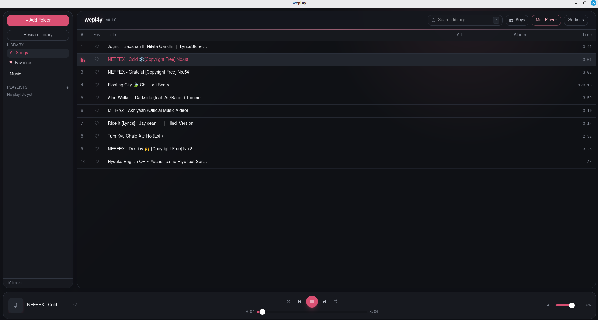
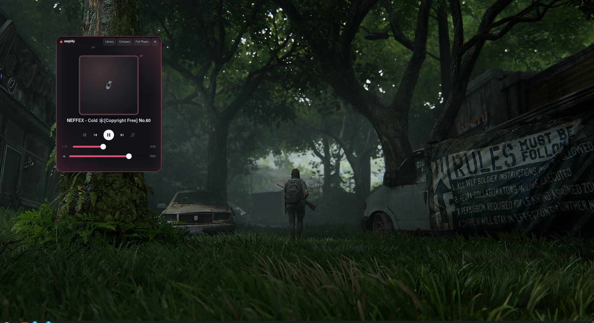

<div align="center">


# WEPL4Y

**NO SKIPS. NO MERCY.**

A fast, lightweight, native-feeling cross-platform desktop music player built with Tauri, Rust, React, and TypeScript.

[Releases](https://github.com/flawme/wepl4y/releases) / [Contributing](CONTRIBUTING.md) / [License](LICENSE) / [Sponsor](https://ko-fi.com/flawme)

</div>

---

## OVERVIEW

wepl4y is designed for local music collections. It focuses on instant response times, low memory overhead, pure-Rust audio decoding, and a floating mini-player for background listening.



---

## KEY FEATURES

- **PURE RUST AUDIO ENGINE**: Gapless playback powered by Rodio and Symphonia. Supports MP3, FLAC, AAC, M4A, ALAC, OGG, OPUS, WAV, and AIFF out of the box without requiring external FFmpeg or system codec installations.
- **FLOATING MINI PLAYER**: An always-on-top, draggable, compact desktop widget with collapsible expansion and track library access.
- **INSTANT LOCAL LIBRARY**: Embedded SQLite database with automatic folder scanning, ID3/Vorbis tag parsing, album artwork extraction, and directory synchronization.
- **FULL KEYBOARD CONTROLS**: Comprehensive hotkey navigation, playback controls, volume manipulation, and in-app shortcuts cheat sheet.
- **HEADS-UP DISPLAY (HUD)**: On-screen notifications confirming hotkey actions such as mute, repeat, and volume adjustments.
- **SYSTEM TRAY INTEGRATION**: Background media control and window switching directly from the desktop taskbar or tray.

---

## MINI PLAYER MODES

<div align="center">
  <table>
    <tr>
      <td align="center">
        <b>COMPACT MODE</b><br/><br/>
        
      </td>
      <td align="center">
        <b>EXPANDED MODE</b><br/><br/>
        
      </td>
    </tr>
  </table>
</div>

---

## DOWNLOAD & INSTALLATION

Pre-built binaries for Linux, macOS, and Windows are available on the [GitHub Releases](https://github.com/flawme/wepl4y/releases) page.

### LINUX

Download the appropriate package from the latest release:

- **Debian / Ubuntu / Linux Mint (`.deb`)**:
  ```bash
  sudo apt install ./wepl4y_*_amd64.deb
  ```

- **Fedora / RHEL / openSUSE (`.rpm`)**:
  ```bash
  sudo dnf install ./wepl4y-*.x86_64.rpm
  ```

- **Universal Linux Portable (`.AppImage`)**:
  ```bash
  chmod +x wepl4y_*_amd64.AppImage
  ./wepl4y_*_amd64.AppImage
  ```

### MACOS

- Download the `.dmg` installer from [Releases](https://github.com/flawme/wepl4y/releases).
- Open the disk image and drag **wepl4y** into your `Applications` folder.
- Universal binary supports both Apple Silicon (M1/M2/M3/M4) and Intel processors.

### WINDOWS

- Download the standard installer `wepl4y_*_x64-setup.exe` or `.msi` from [Releases](https://github.com/flawme/wepl4y/releases).
- Run the setup executable and follow the installation prompts.

---

## KEYBOARD SHORTCUTS

| ACTION | SHORTCUT |
| :--- | :--- |
| **PLAY / PAUSE** | `Space` or `K` |
| **NEXT TRACK** | `Shift + Right Arrow` or `N` |
| **PREVIOUS TRACK** | `Shift + Left Arrow` or `P` |
| **SEEK FORWARD / BACKWARD (5S)** | `Right Arrow` / `Left Arrow` |
| **SEEK FORWARD / BACKWARD (10S)** | `L` / `J` |
| **VOLUME UP / DOWN (5%)** | `Up Arrow` / `Down Arrow` |
| **MUTE / UNMUTE** | `M` |
| **TOGGLE SHUFFLE** | `S` |
| **CYCLE REPEAT (OFF / ALL / ONE)** | `R` |
| **TOGGLE FAVORITE** | `F` |
| **FOCUS SEARCH** | `/` or `Ctrl + F` |
| **SHORTCUTS GUIDE** | `?` or `H` |
| **TOGGLE MINI PLAYER LIBRARY** | `Tab` *(in Mini Player)* |
| **DISMISS / CLEAR** | `Escape` |

---

## BUILDING FROM SOURCE

### PREREQUISITES

- **Node.js** (v18+) and **npm**
- **Rust Toolchain** (latest stable: `rustup default stable`)
- **Platform Dependencies**:
  - **Linux**: `sudo apt install libwebkit2gtk-4.1-dev libgtk-3-dev libasound2-dev libssl-dev build-essential pkg-config`
  - **macOS**: `xcode-select --install`
  - **Windows**: Visual Studio C++ Build Tools & WebView2

### INSTRUCTIONS

1. **Clone the repository**:
   ```bash
   git clone https://github.com/flawme/wepl4y.git
   cd wepl4y
   ```

2. **Install Node modules**:
   ```bash
   npm install
   ```

3. **Run in development mode**:
   ```bash
   npm run tauri dev
   ```

4. **Build production binaries**:
   ```bash
   npm run tauri build
   ```

---

## ARCHITECTURE

- **Frontend**: React 18, TypeScript, Tailwind CSS, Vite.
- **Desktop Runtime**: Tauri v2.
- **Audio Engine**: Rodio 0.20 + Symphonia pure-Rust decoders (zero external runtime dependencies).
- **Database & Metadata**: SQLite via Rusqlite (WAL mode) and Lofty for ID3/Vorbis tag parsing.

---

## SPONSORSHIP

If you enjoy using wepl4y and would like to support its continued development:

- **Ko-fi**: [ko-fi.com/flawme](https://ko-fi.com/flawme)

---

## LICENSE

Distributed under the [MIT License](LICENSE). Copyright (c) 2026 flawme and wepl4y contributors.
